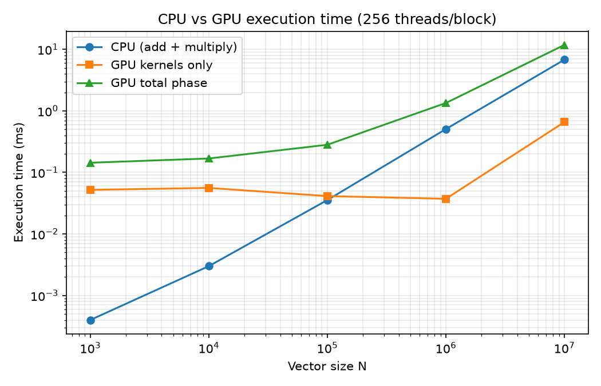
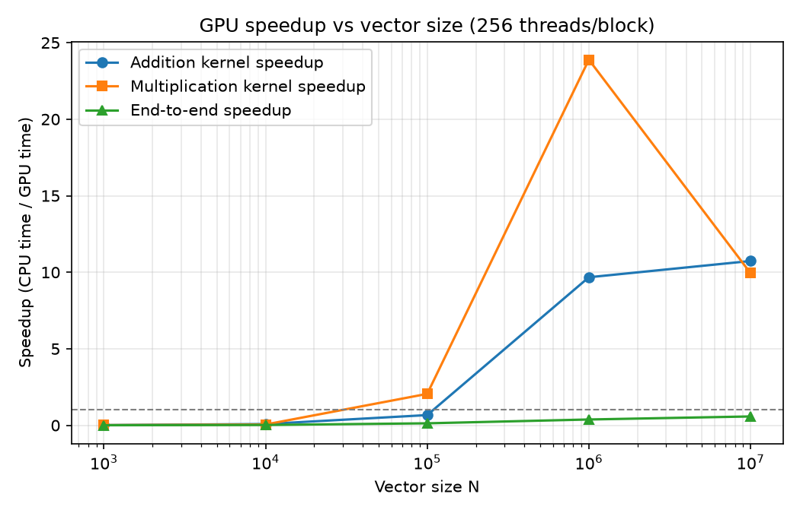
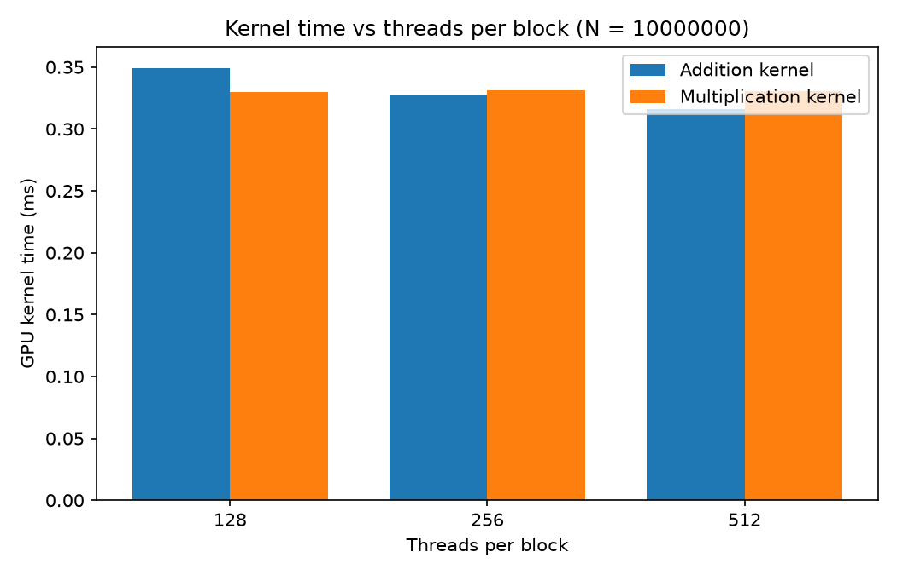

# GPU Vector Operations using CUDA

## Overview

This experiment implements and evaluates **vector addition** and **element-wise vector multiplication** using both sequential CPU execution and parallel GPU execution using NVIDIA CUDA.

The experiment compares CPU and GPU performance for different vector sizes and different CUDA thread-block configurations.

The study focuses on:

- CPU execution time
- GPU kernel execution time
- Total GPU phase time
- Kernel speedup
- End-to-end speedup
- Correctness verification
- Effect of vector size
- Effect of threads per block
- GPU memory-transfer and kernel-launch overhead
- Performance analysis using graphs

## Team Members
- Aditya R Gavimath (01FE24BCI120)
- Manasa B Vasare (01FE24BCI113)
- Renuka Kagadal (01FE24BCI119)

---

# Problem Statement

Given two vectors `A` and `B` of length `N`, perform the following operations.

### Vector Addition

```text
C[i] = A[i] + B[i]
```

### Element-wise Vector Multiplication

```text
C[i] = A[i] * B[i]
```

The CPU performs the operations sequentially, while CUDA assigns independent vector elements to GPU threads so that the operations can execute in parallel.

---

# Objectives

1. Implement sequential vector addition on the CPU.
2. Implement sequential vector multiplication on the CPU.
3. Implement vector addition using CUDA.
4. Implement vector multiplication using CUDA.
5. Verify CPU and GPU correctness.
6. Measure CPU execution time.
7. Measure GPU kernel execution time.
8. Measure total GPU phase time.
9. Calculate kernel speedup.
10. Calculate end-to-end speedup.
11. Study different vector sizes.
12. Study different CUDA thread-block sizes.
13. Store experimental measurements in CSV format.
14. Generate performance graphs.
15. Analyze GPU performance and overhead.

---

# Technologies Used

| Technology | Purpose |
|---|---|
| C++ | Sequential CPU implementation |
| NVIDIA CUDA | Parallel GPU implementation |
| `nvcc` | CUDA compiler |
| Microsoft Visual C++ | Windows host compiler |
| NVIDIA RTX 4500 Ada Generation | GPU |
| Python 3 | Result processing and graph generation |
| Pandas | CSV data processing |
| Matplotlib | Graph generation |
| PowerShell | Command execution |
| Git | Version control |
| GitHub | Repository hosting |

---

# Hardware and Software Environment

| Component | Configuration |
|---|---|
| GPU | NVIDIA RTX 4500 Ada Generation |
| NVIDIA Driver | 610.47 |
| CUDA Toolkit | 13.4 |
| `nvcc` | 13.4.92 |
| Host Compiler | Microsoft Visual C++ |
| Operating System | Windows |

---

# CUDA Execution Model

CUDA organizes GPU execution using a hierarchy of:

```text
Grid
 |
 +---- Block
        |
        +---- Thread
        +---- Thread
        +---- Thread
        +---- ...
```

Each CUDA thread is responsible for one logical vector element.

The global thread index is calculated as:

```cpp
int i = blockIdx.x * blockDim.x + threadIdx.x;
```

The kernel checks whether the calculated index is within the vector:

```cpp
if (i < N)
```

The number of blocks required is calculated using:

```cpp
int blocksPerGrid = (N + threadsPerBlock - 1) / threadsPerBlock;
```

This allows the program to handle vector sizes that are not exact multiples of the selected number of threads per block.

---

# CPU and GPU Approach

## Sequential CPU

The CPU processes the vector elements one after another:

```text
for i = 0 ... N-1

    C[i] = A[i] + B[i]

    C[i] = A[i] * B[i]
```

---

## Parallel GPU

CUDA assigns vector elements to independent GPU threads:

```text
Thread 0 → C[0]
Thread 1 → C[1]
Thread 2 → C[2]
Thread 3 → C[3]
...
```

The GPU kernel performs:

```cpp
C[i] = A[i] + B[i];
```

and:

```cpp
C[i] = A[i] * B[i];
```

---

# Experiment Flow

```text
Windows PowerShell
        |
        v
Verify NVIDIA GPU
        |
        v
Verify CUDA Toolkit
        |
        v
Verify Microsoft C/C++ Compiler
        |
        v
Sequential CPU Baseline
        |
        v
CUDA Compilation
        |
        v
CUDA Correctness Test
        |
        v
Vector-Size Experiment
        |
        v
Thread-Configuration Experiment
        |
        v
results.csv
        |
        v
summary.csv
        |
        v
Performance Graphs
        |
        v
Performance Analysis
```

---

# Experimental Configuration

## Vector Size Experiment

The following vector sizes were tested:

| Test | Vector Size |
|---:|---:|
| 1 | 1,000 |
| 2 | 10,000 |
| 3 | 100,000 |
| 4 | 1,000,000 |
| 5 | 10,000,000 |

For the vector-size experiment:

```text
Threads per Block = 256
```

Each configuration was executed three times.

```text
5 vector sizes × 3 repetitions = 15 executions
```

---

## Thread Configuration Experiment

For the thread study:

```text
Vector Size = 10,000,000
```

The following configurations were tested:

| Configuration | Threads per Block |
|---|---:|
| A | 128 |
| B | 256 |
| C | 512 |

Each configuration was executed three times.

```text
3 thread configurations × 3 repetitions = 9 executions
```

---

# Execution Commands

## Environment Verification

Open **Windows PowerShell** or **Developer PowerShell for VS**.

```powershell
# ============================================================
# ENVIRONMENT VERIFICATION
# ============================================================

# Verify that the NVIDIA GPU is detected
nvidia-smi

# Verify CUDA Toolkit and nvcc
nvcc --version

# Locate the CUDA compiler
where.exe nvcc

# Locate the Microsoft C/C++ host compiler
where.exe cl

# Check available file-system drives
Get-PSDrive -PSProvider FileSystem

# Check the current working directory
pwd
```

### Expected Environment

The verified environment is:

```text
GPU           : NVIDIA RTX 4500 Ada Generation
Driver        : 610.47
CUDA Toolkit  : 13.4
nvcc          : 13.4.92
Host Compiler : Microsoft Visual C++
```

---

# Environment Evidence

## NVIDIA GPU Detection

Command:

```powershell
nvidia-smi
```


---

## CUDA Version

Command:

```powershell
nvcc --version
```


---

## CUDA Compiler Path

Command:

```powershell
where.exe nvcc
```


---

## Microsoft C/C++ Compiler Path

Command:

```powershell
where.exe cl
```


---

## PowerShell / File-System Environment

Commands:

```powershell
where.exe cl
Get-PSDrive -PSProvider FileSystem
```


---

# Project Setup

The project should be stored in a user-writable directory rather than:

```text
C:\Windows\System32
```

Use the following commands:

```powershell
# ============================================================
# PROJECT SETUP
# ============================================================

# Move to the user's home directory
cd $HOME

# Create the project directory
mkdir gpu-vector-operations

# Enter the project directory
cd gpu-vector-operations

# Create the source directory
mkdir src

# Check the current directory
pwd

# List the project contents
dir

# List the source directory
dir src
```

---

# CPU Baseline

The sequential CPU implementation is used as the baseline for performance comparison.

The CPU performs:

```text
Vector Addition:
C[i] = A[i] + B[i]

Vector Multiplication:
C[i] = A[i] * B[i]
```

---

## Create / Open CPU Source

```powershell
# ============================================================
# CPU BASELINE SOURCE
# ============================================================

# Open the CPU source file
notepad src\cpu_baseline.cpp

# Verify the source file
dir src
```

Make sure the file is saved as:

```text
cpu_baseline.cpp
```

and not:

```text
cpu_baseline.cpp.txt
```

---

# Compile CPU Baseline

```powershell
# ============================================================
# CPU COMPILATION
# ============================================================

# Compile the sequential CPU program
cl /O2 /EHsc src\cpu_baseline.cpp /Fe:cpu_baseline.exe

# Verify the generated executable
dir

# Verify the CPU executable specifically
dir cpu_baseline.exe
```

### Explanation

```text
/O2
```

enables compiler optimization.

```text
/EHsc
```

enables standard C++ exception handling.

The compilation should generate:

```text
cpu_baseline.exe
cpu_baseline.obj
```

---

# Run CPU Baseline

```powershell
# ============================================================
# CPU BASELINE EXECUTION
# ============================================================

# Run the sequential CPU program
.\cpu_baseline.exe
```

Enter:

```text
1000
```

For `N = 1000`, the deterministic checksums are:

| Result | Expected Value |
|---|---:|
| Addition Checksum | 100000 |
| Multiplication Checksum | 3333000 |

CPU timing values are machine-dependent and should always be taken from the actual machine measurements.

---

# CUDA Verification

Before compiling the CUDA program, verify the GPU and CUDA compiler again.

```powershell
# ============================================================
# CUDA VERIFICATION
# ============================================================

# Verify NVIDIA GPU
nvidia-smi

# Verify CUDA compiler
nvcc --version

# Locate nvcc
where.exe nvcc

# Locate Microsoft host compiler
where.exe cl
```

---

# CUDA Program Compilation

The CUDA vector-operation program is compiled using `nvcc`.

```powershell
# ============================================================
# CUDA COMPILATION
# ============================================================

# Compile the CUDA vector-operation program
nvcc -O2 src\vector_operations.cu -o vector_operations.exe

# Verify project contents
dir

# Verify CUDA executable
dir vector_operations.exe
```

### Expected Result

The compilation should produce:

```text
vector_operations.exe
```

without compilation errors.

---

# First CUDA Test

Run the program:

```powershell
# ============================================================
# FIRST CUDA TEST
# ============================================================

# Start the CUDA program
.\vector_operations.exe
```

Enter:

```text
Vector Size:
1000

Threads per Block:
256
```

The first test verifies that:

```text
Addition Correctness    = PASS
Multiplication Correctness = PASS
```

The program also creates:

```text
results.csv
```

---

# Clean Old Results

Before collecting final performance results, remove old test rows.

```powershell
# ============================================================
# CLEAN OLD RESULTS
# ============================================================

# Remove previous results
Remove-Item results.csv -ErrorAction SilentlyContinue

# Verify whether results.csv exists
dir results.csv
```

This prevents the initial smoke-test run from being mixed with the final performance measurements.

---

# Vector-Size Performance Experiment

For this experiment:

```text
Threads per Block = 256
```

The vector sizes are:

```text
1,000
10,000
100,000
1,000,000
10,000,000
```

Run every vector size three times.

```powershell
# ============================================================
# VECTOR-SIZE EXPERIMENT
# ============================================================
# Threads per Block = 256
# Repetitions = 3
# Total executions = 15
# ============================================================

for ($rep = 1; $rep -le 3; $rep++) {

    foreach ($n in 1000,10000,100000,1000000,10000000) {

        # Send vector size and threads per block
        "$n`n256" | .\vector_operations.exe

    }
}
```

### Expected Result

```text
5 vector sizes × 3 repetitions = 15 runs
```

Each run should report:

```text
Addition Correctness = PASS
Multiplication Correctness = PASS
```

and append a row to:

```text
results.csv
```

---

# Manual Vector-Size Execution

Individual runs can also be performed manually.

## N = 1,000

```powershell
.\vector_operations.exe
```

Enter:

```text
1000
256
```

---

## N = 10,000

```powershell
.\vector_operations.exe
```

Enter:

```text
10000
256
```

---

## N = 100,000

```powershell
.\vector_operations.exe
```

Enter:

```text
100000
256
```

---

## N = 1,000,000

```powershell
.\vector_operations.exe
```

Enter:

```text
1000000
256
```

---

## N = 10,000,000

```powershell
.\vector_operations.exe
```

Enter:

```text
10000000
256
```

---

# Vector-Size Execution Evidence

## N = 1,000

```text
Vector Size       = 1,000
Threads per Block = 256
```


---

## N = 10,000

```text
Vector Size       = 10,000
Threads per Block = 256
```


---

## N = 100,000

```text
Vector Size       = 100,000
Threads per Block = 256
```


---

## N = 1,000,000

```text
Vector Size       = 1,000,000
Threads per Block = 256
```


---

## N = 10,000,000

```text
Vector Size       = 10,000,000
Threads per Block = 256
```


---

# Check Results

The CUDA program automatically appends every execution to `results.csv`.

```powershell
# ============================================================
# CHECK VECTOR-SIZE RESULTS
# ============================================================

# Verify that results.csv exists
dir results.csv

# Display recorded results
Get-Content results.csv
```

---

#  Thread Configuration Experiment

The vector size is fixed at:

```text
N = 10,000,000
```

The following thread configurations are tested:

```text
128 threads/block
256 threads/block
512 threads/block
```

Each configuration is executed three times.

```powershell
# ============================================================
# THREAD CONFIGURATION EXPERIMENT
# ============================================================
# Vector Size = 10,000,000
# Repetitions = 3
# Total executions = 9
# ============================================================

for ($rep = 1; $rep -le 3; $rep++) {

    foreach ($t in 128,256,512) {

        # Send vector size and threads per block
        "10000000`n$t" | .\vector_operations.exe

    }
}
```

### Expected Result

```text
3 thread configurations × 3 repetitions = 9 runs
```

All nine runs should report:

```text
Addition Correctness = PASS
Multiplication Correctness = PASS
```

---

# Manual Thread Configuration

## 128 Threads per Block

```powershell
.\vector_operations.exe
```

Enter:

```text
10000000
128
```

---

## 256 Threads per Block

```powershell
.\vector_operations.exe
```

Enter:

```text
10000000
256
```

---

## 512 Threads per Block

```powershell
.\vector_operations.exe
```

Enter:

```text
10000000
512
```

---

# Thread Configuration Evidence

## 128 Threads per Block

```text
Vector Size       = 10,000,000
Threads per Block = 128
```


---

## 256 Threads per Block

```text
Vector Size       = 10,000,000
Threads per Block = 256
```


---

## 512 Threads per Block

```text
Vector Size       = 10,000,000
Threads per Block = 512
```


---

# Check Final Results

```powershell
# ============================================================
# FINAL RESULT CHECK
# ============================================================

# Verify results.csv
dir results.csv

# Display all recorded results
Get-Content results.csv
```

---

# Results CSV

The experiment records the following columns:

| Column | Meaning |
|---|---|
| `N` | Vector size |
| `ThreadsPerBlock` | CUDA threads per block |
| `CPU_Add_ms` | CPU addition time |
| `CPU_Mul_ms` | CPU multiplication time |
| `GPU_Add_Kernel_ms` | GPU addition kernel time |
| `GPU_Mul_Kernel_ms` | GPU multiplication kernel time |
| `Total_GPU_ms` | Total GPU phase time |
| `Add_Speedup` | Addition kernel speedup |
| `Mul_Speedup` | Multiplication kernel speedup |
| `EndToEnd_Speedup` | End-to-end speedup |
| `Add_Correct` | Addition correctness |
| `Mul_Correct` | Multiplication correctness |

---

# Python Environment

Python is used to process the experimental CSV data and generate the graphs.

```powershell
# ============================================================
# PYTHON ENVIRONMENT
# ============================================================

# Check Python version
python --version

# Install required plotting/data-processing libraries
pip install pandas matplotlib

# Verify Pandas
python -c "import pandas; print(pandas.__version__)"

# Verify Matplotlib
python -c "import matplotlib; print(matplotlib.__version__)"
```

---

# Generate Performance Graphs

The graph-generation script is:

```text
src/plot_results.py
```

Run:

```powershell
# ============================================================
# GRAPH GENERATION
# ============================================================

# Generate summary.csv and performance graphs
python scripts\plot_results.py

# Verify generated graph files
dir graphs

# Verify generated summary
dir summary.csv

# Display summary results
Get-Content summary.csv
```

The script generates:

```text
summary.csv
graph1_time_vs_size.png
graph2_speedup_vs_size.png
graph3_kernel_vs_threads.png
```

---

# Performance Graphs

## Execution Time vs Vector Size



This graph compares:

- CPU execution time
- GPU kernel execution time
- Total GPU phase time

for different vector sizes.

---

## Speedup vs Vector Size



This graph compares:

- Addition kernel speedup
- Multiplication kernel speedup
- End-to-end speedup

for different vector sizes.

---

## GPU Kernel Time vs Threads per Block



This graph compares GPU kernel execution time for:

```text
128 threads/block
256 threads/block
512 threads/block
```

at the largest tested vector size.

---

# Recorded Vector-Size Results

The averaged measurements for the vector-size experiment using 256 threads per block are:

| N | CPU Add (ms) | CPU Mul (ms) | GPU Add Kernel (ms) | GPU Mul Kernel (ms) | Total GPU (ms) | Add Speedup | Mul Speedup | End-to-End |
|---:|---:|---:|---:|---:|---:|---:|---:|---:|
| 1,000 | 0.000200 | 0.000200 | 0.021352 | 0.030736 | 0.143656 | 0.011344× | 0.008888× | 0.003478× |
| 10,000 | 0.001700 | 0.001300 | 0.021504 | 0.034475 | 0.168395 | 0.081705× | 0.051797× | 0.020456× |
| 100,000 | 0.017733 | 0.017833 | 0.027893 | 0.013344 | 0.281461 | 0.667200× | 2.053424× | 0.129574× |
| 1,000,000 | 0.261700 | 0.244600 | 0.027029 | 0.010240 | 1.343179 | 9.672405× | 23.886719× | 0.379052× |
| 10,000,000 | 3.499700 | 3.291460 | 0.327718 | 0.331162 | 11.802694 | 10.734719× | 9.939625× | 0.577858× |

---

# Recorded Thread Configuration Results

For:

```text
N = 10,000,000
```

| Threads per Block | GPU Add Kernel (ms) | GPU Mul Kernel (ms) | Total GPU (ms) | End-to-End |
|---:|---:|---:|---:|---:|
| 128 | 0.349232 | 0.329728 | 12.103680 | 0.551406× |
| 256 | 0.327718 | 0.331162 | 11.802694 | 0.577858× |
| 512 | 0.316000 | 0.330752 | 10.944885 | 0.630326× |

---

# Correctness Results

The recorded executions produced:

| Operation | PASS | FAIL |
|---|---:|---:|
| Vector Addition | 23 | 0 |
| Vector Multiplication | 23 | 0 |

Therefore:

```text
Addition       → 23 PASS / 0 FAIL
Multiplication → 23 PASS / 0 FAIL
```

Correctness was maintained for the recorded configurations used in the performance study.

---

# Performance Metrics

## CPU Execution Time

CPU execution time is the time required for the sequential CPU implementation to perform the operation.

---

## GPU Kernel Time

GPU kernel time measures only the execution of the CUDA kernel.

It does not include the complete host-to-device and device-to-host data-transfer process.

---

## Total GPU Phase Time

The total GPU phase consists of:

```text
Host → Device Copy
        +
Vector Addition Kernel
        +
Vector Multiplication Kernel
        +
Device → Host Copy
```

---

## Kernel Speedup

Addition:

```text
Add Speedup =
CPU Addition Time / GPU Addition Kernel Time
```

Multiplication:

```text
Mul Speedup =
CPU Multiplication Time / GPU Multiplication Kernel Time
```

---

## End-to-End Speedup

```text
End-to-End Speedup =
(CPU Addition Time + CPU Multiplication Time)
/
Total GPU Phase Time
```

---

# Performance Analysis

## Effect of Vector Size

For small vectors, GPU overhead can dominate the actual computation.

The GPU has overhead associated with:

- Memory allocation
- Host-to-device transfer
- Device-to-host transfer
- Kernel launch
- Synchronization
- CUDA runtime initialization

Therefore, the GPU may not provide an overall advantage for very small vector sizes.

As the vector size increases, the GPU receives more independent work and can utilize its parallel processing capability more effectively.

---

# Small Vector Performance

For:

```text
N = 1,000
```

the GPU kernel execution time is already influenced significantly by fixed GPU overhead.

The recorded kernel speedups were:

```text
Addition       = 0.011344×
Multiplication = 0.008888×
```

The end-to-end speedup was:

```text
0.003478×
```

This demonstrates that GPU acceleration is not automatically beneficial for small workloads.

---

# Large Vector Performance

For:

```text
N = 10,000,000
```

the recorded results were:

```text
Addition Kernel Speedup       = 10.734719×
Multiplication Kernel Speedup = 9.939625×
End-to-End Speedup            = 0.577858×
```

This demonstrates that the GPU kernels can execute the actual vector computation much faster than the CPU baseline.

However, the complete GPU phase still includes data movement and other overhead.

---

# Highest Kernel Speedups

## Addition

The highest recorded addition kernel speedup was:

```text
10.734719×
```

at:

```text
N = 10,000,000
```

---

## Multiplication

The highest recorded multiplication kernel speedup was:

```text
23.886719×
```

at:

```text
N = 1,000,000
```

---

# Kernel Speedup vs End-to-End Speedup

An important result from this experiment is:

```text
Kernel Speedup ≠ End-to-End Speedup
```

For example, at:

```text
N = 10,000,000
```

the addition kernel achieved:

```text
10.734719×
```

kernel speedup.

However, the end-to-end speedup was:

```text
0.577858×
```

The difference occurs because the end-to-end measurement includes GPU memory-transfer and execution overhead.

Therefore:

```text
Kernel timing
```

answers:

> How fast can the GPU perform the computation itself?

while:

```text
End-to-end timing
```

answers:

> How fast is the complete GPU-based application after including data movement and GPU overhead?

---

#  Thread Configuration Analysis

The thread configuration study was performed using:

```text
N = 10,000,000
```

The recorded total GPU phase times were:

| Threads per Block | Total GPU Time |
|---:|---:|
| 128 | 12.103680 ms |
| 256 | 11.802694 ms |
| 512 | 10.944885 ms |

The lowest recorded total GPU phase time among the tested configurations was:

```text
512 threads/block
```

with:

```text
10.944885 ms
```

---

# Why Threads per Block Matter

The threads-per-block configuration affects how CUDA schedules the workload.

The experiment compares:

```text
128 threads/block
256 threads/block
512 threads/block
```

Changing the block size changes:

- Number of blocks
- Thread scheduling
- GPU resource utilization
- Kernel execution behavior

Therefore, different thread configurations can produce different execution times.

---

# Memory-Bound Nature of Vector Operations

Vector addition and multiplication perform relatively little arithmetic compared with the amount of data that must be accessed.

For each element, the GPU generally needs to:

```text
Read A[i]
Read B[i]
Perform arithmetic
Write C[i]
```

Therefore, the workload is strongly influenced by memory access and memory bandwidth.

This is one reason why high theoretical GPU compute capability does not automatically translate into proportional application-level speedup.

---

# Important Performance Observation

The experiment demonstrates three important cases:

```text
Small N
   ↓
GPU overhead dominates
   ↓
Low or negative speedup
```

```text
Large N
   ↓
More parallel work
   ↓
Higher kernel speedup
```

```text
Complete GPU application
   ↓
Memory transfers + kernel execution + synchronization
   ↓
End-to-end speedup may still be limited
```

---


# Final Performance Summary

| Metric | Result |
|---|---:|
| GPU | NVIDIA RTX 4500 Ada Generation |
| Driver | 610.47 |
| CUDA Toolkit | 13.4 |
| `nvcc` | 13.4.92 |
| Vector-size range | 1,000 – 10,000,000 |
| Threads tested | 128, 256, 512 |
| Vector-size repetitions | 3 |
| Thread-study repetitions | 3 |
| Highest Addition Kernel Speedup | 10.734719× |
| Highest Multiplication Kernel Speedup | 23.886719× |
| Lowest Tested Total GPU Time | 10.944885 ms |
| Best Tested Thread Configuration | 512 threads/block |
| Addition Correctness | 23 PASS / 0 FAIL |
| Multiplication Correctness | 23 PASS / 0 FAIL |

---


# Conclusion

This experiment demonstrates the use of NVIDIA CUDA for parallel vector operations and compares GPU execution with a sequential CPU baseline.

The experiment shows that GPU acceleration depends strongly on workload size and execution overhead.

For small vectors, GPU launch and memory-transfer overhead can dominate the computation.

For large vectors, the GPU provides much greater parallelism and the CUDA kernels achieve significant speedups.

The experiment also demonstrates that:

- Kernel-only speedup and end-to-end speedup are different.
- GPU memory transfers affect complete application performance.
- Thread-block configuration can affect kernel execution time.
- Correctness must be verified before performance comparison.
- Vector addition and multiplication are strongly influenced by memory access and memory bandwidth.
- Performance conclusions should be based on measurements from the actual machine.

The highest recorded kernel speedups were:

```text
Vector Addition       → 10.734719×
Vector Multiplication → 23.886719×
```

The best tested thread configuration in terms of total GPU phase time was:

```text
512 threads/block
```

with:

```text
10.944885 ms
```

All recorded executions passed correctness verification:

```text
Addition       → 23 PASS / 0 FAIL
Multiplication → 23 PASS / 0 FAIL
```

The overall conclusion is:

> **CUDA can provide substantial kernel-level acceleration for sufficiently large parallel workloads, but the complete application performance is also affected by memory transfers, kernel-launch overhead, synchronization, and other GPU runtime costs.**

# Repository Structure

```text
gpu-vector-operations/
│
├── README.md
├── .gitignore
│
├── report/
│   └── CUDA_Vector_Operations_Observations_Analysis_Conclusion.docx
│
├── graphs/
│   ├── graph1_time_vs_size.png
│   ├── graph2_speedup_vs_size.png
│   └── graph3_kernel_vs_threads.png
│
├── results/
│   ├── results.csv
│   └── summary.csv
│
├── src/
│   └── plot_results.py
│
├── report/screenshots/
│   ├── Screenshot 2026-09-18 102643.png
│   ├── Screenshot 2026-10-06 104814.png
│   ├── Screenshot 2026-10-06 104830.png
│   ├── Screenshot 2026-10-06 104858.png
│   ├── Screenshot 2026-10-06 105019.png
│   ├── Screenshot 2026-10-06 105100.png
│   ├── Screenshot 2026-10-06 110326.png
│   ├── Screenshot 2026-10-06 110345.png
│   ├── Screenshot 2026-10-06 110432.png
│   ├── Screenshot 2026-10-06 110528.png
│   ├── Screenshot 2026-10-06 110558.png
│   ├── Screenshot 2026-10-06 110715.png
│   ├── Screenshot 2026-10-06 110743.png
│   ├── Screenshot 2026-10-06 110810.png
│   ├── Screenshot 2026-10-06 110839.png
│   ├── Screenshot 2026-10-06 110946.png
│   ├── Screenshot 2026-10-06 111125.png
│   ├── Screenshot 2026-10-06 111152.png
│   └── Screenshot 2026-10-06 111216.png
│
└── src/
    ├── cuda_test.cu
    └── cuda_test.cu.txt
```

---
